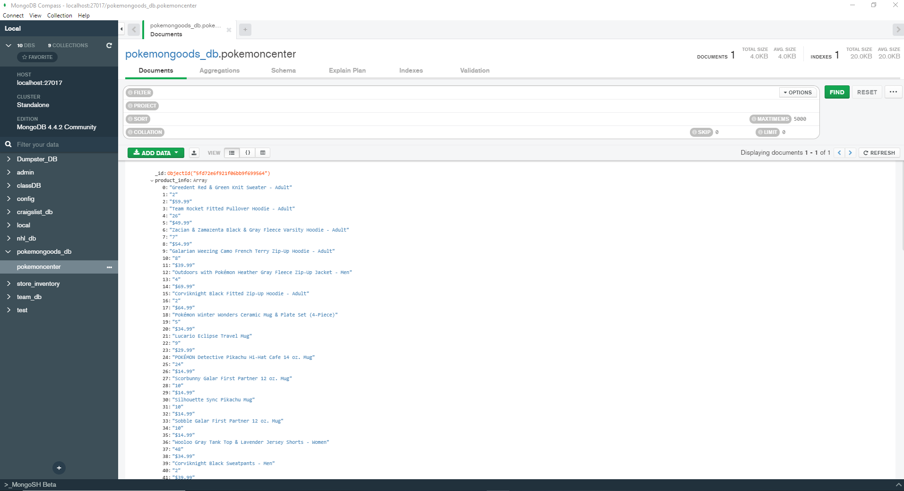

# ETL-project

Overview -
	This project uses an established connection to MongoDB to web scrape the PokemonCenter website for items that have reviews and which item has the highest review. One issue that occurred is when the code runs, once the "browser.visit(url)" section is reached, the website requires a CAPTCHA. Which means that if the browser is opened from the code and the CAPTCHA isn't completed on the PokemonCenter website, then the code won't parser. The simple fix was to go to the site that opens and complete the CAPTCHA and rerun the parser. The goal was to determine which product had the highest amount of reviews and grab the image for that product. Another issue that occurred was trying to load the data into MongoDB. Some titles contain a ".", and due to the period, the data wouldn't export into a database. The way around that was to create a dictionary that had all of the lists.

Export -
	The exported data was from a website called "Pokemoncenter.com" where items that pertain to Pokemon are sold. The page that the data was extracted from was a list of items that had: the product name, the image, the price, and the amount of reviews (if any). The "inspect" was used through the entire project in order to determine what name and class to search for.

Transform -
	Once the specific names and classes were found, the data was scraped into three different lists. Each list had the product name, price, and number of reviews. Initially, the reviews had a string such as "4 reviews" so the ".split()[0]" function was used in order to separate the integer. The code runs so that the items that did not contain a review were excluded from the dataset. From the lists, the data was then turned into a dictonary so it could be loaded into MongoDB. Viewing the data as a dictionary made it easier to see that the item with the highest amount of reviews was the Wooloo Gray Tank Top & Lavender Jersey Shorts - Women with 48 reviews.

Load -
	With the dictionary, the data was loaded into a database collection and exported to MongoDB. The code also contains a "drop" function so any duplicated databases are dropped before one is loaded. 

